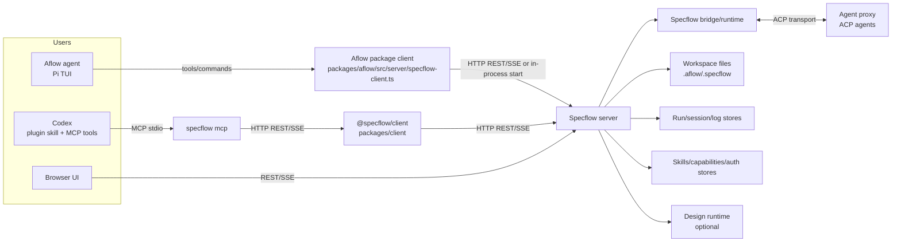
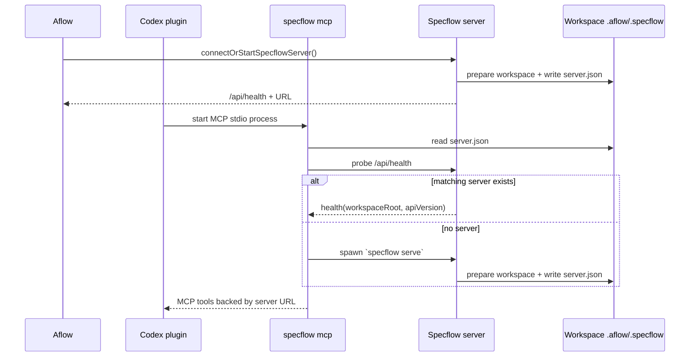
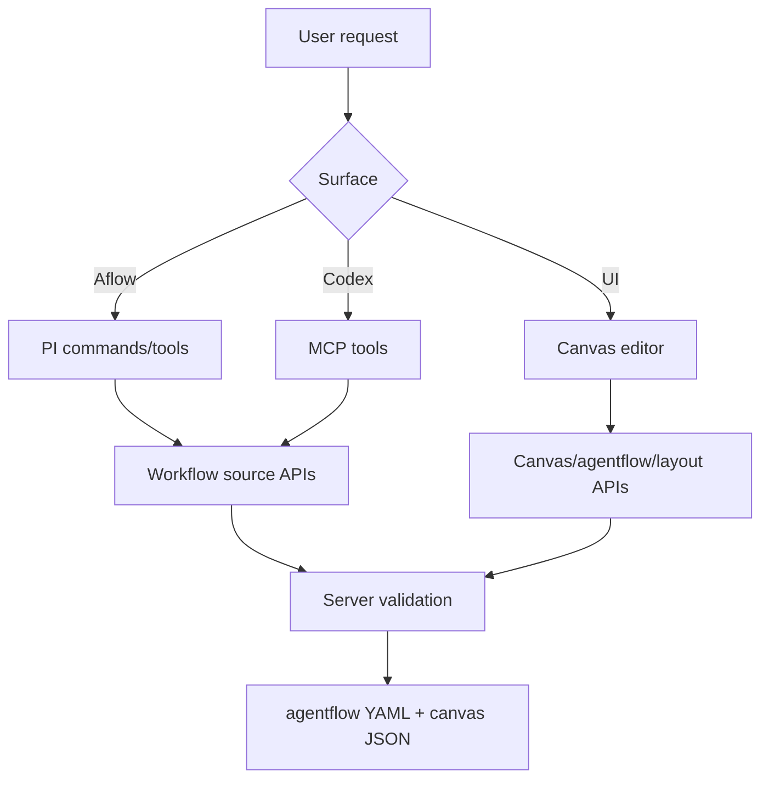
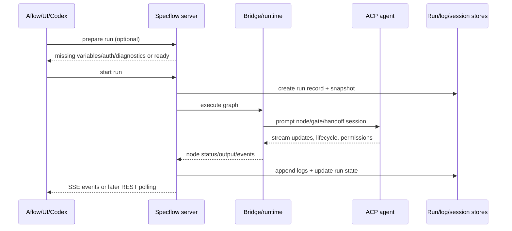
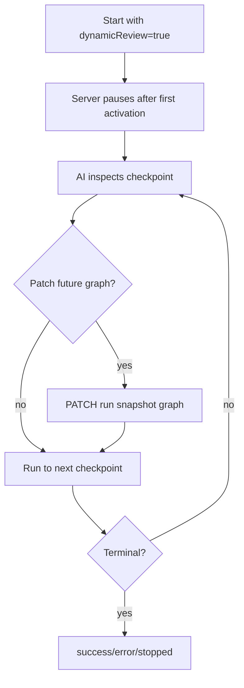
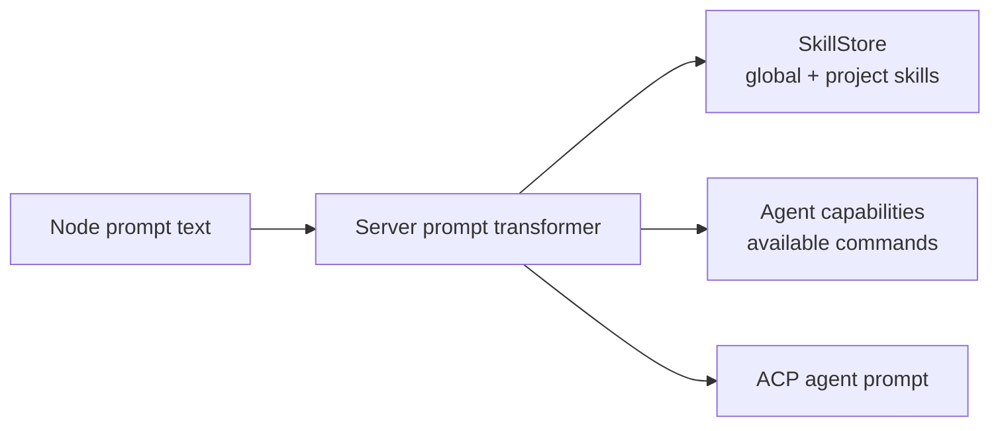
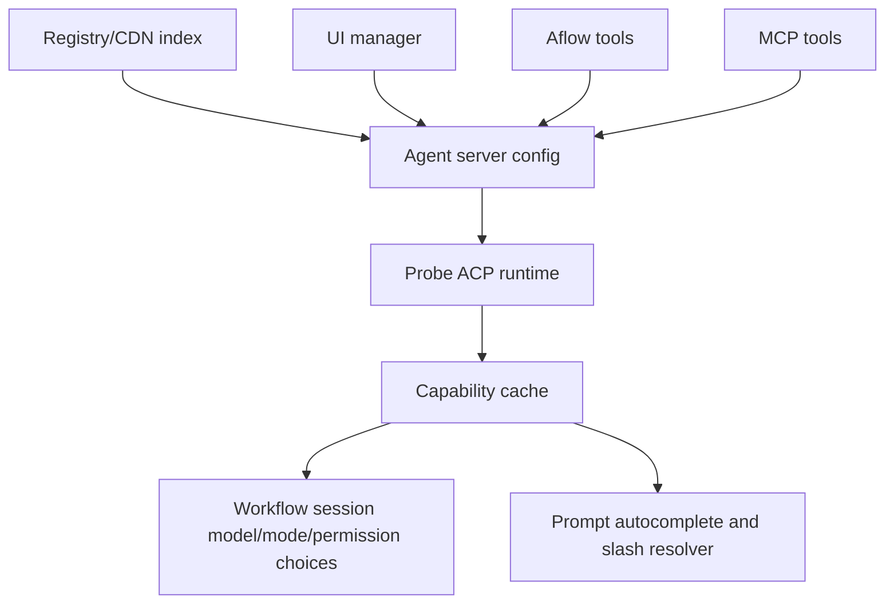
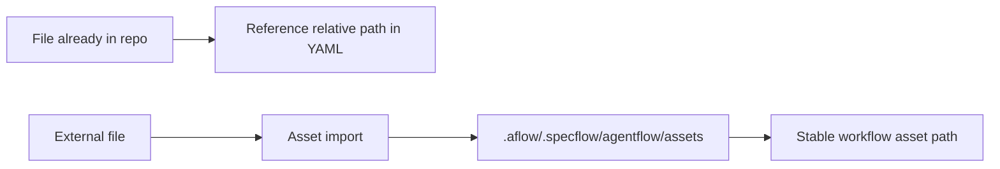

# Specflow 系统架构

这份文档说明 Specflow 如何在原生 Aflow agent、浏览器 UI、Codex plugin、
server、workspace 文件和 ACP agent runtime 之间流转数据与控制。

配套文档：

- `docs/architecture/capability-matrix.md`：Aflow agent、UI、Codex plugin 能力对照。
- `docs/architecture/conventions.md`：工程约定和 package 边界。
- `docs/architecture/glossary.md`：维护者术语表。
- `docs/architecture/acp-capabilities.md`：ACP 当前实现能力。

## 总体结构



核心边界是 server。只要一个能力会影响 workflow source、runs、logs、
sessions、capabilities、auth 或 assets，就应该尽量落在 server API 和 server
stores 上。Aflow、UI、Codex 只是不同入口。

## Package 职责

| Package/path | 职责 |
|---|---|
| `packages/aflow` | 原生 Aflow agent。注册 Pi commands 和 AI-visible tools，通过包内 `src/server/specflow-client.ts` 启动或连接 Specflow server，把 run events stream 到 TUI，并保留 Aflow 特有的 prompts/session picker 体验。当前 Aflow 不使用 `@specflow/client`。 |
| `packages/ui` | 浏览器应用。负责可视化 canvas editor、run controls、logs/timeline、interactions、auth terminal modal、agent server manager、skill/command autocomplete 和 design UI。 |
| `packages/server` | workspace server。负责 HTTP APIs、static UI serving、workspace 初始化、workflow source IO、canvas IO、validation、run orchestration、run control、logs、sessions、agent server config、skills、auth、assets 和 design APIs。 |
| `packages/client` | `@specflow/client` 通用 HTTP/SSE client package，当前供 MCP/Codex 和未来其他非浏览器 plugin/agent 入口使用。它应该保持薄层，不复制业务规则。 |
| `packages/mcp` | Codex 的 stdio MCP 层。定位或启动 workspace server，暴露 MCP tools，并把 tool calls 翻译成 `@specflow/client` 调用。 |
| `packages/workflow` | 共享 workflow schema/model validation 组件。这里的 workflow 是通用执行术语，不等于必须改用户可见文件夹名。 |
| `packages/shared` | 共享 constants、UUID、SSE event names/types 和公共 types。 |
| `plugins/specflow-codex` | 可安装的 Codex plugin metadata、MCP config 和 Codex skill instructions。不打包 Specflow binary。 |
| `docs/public/tutorial` | 面向最终用户的教程文档。 |
| `docs/decisions` | ADR 风格的设计决策。适合解释为什么这样设计，但不是完整运行地图。 |

## Workspace 文件

workspace root 是用户正在创建/运行 agentflows 的仓库。

```text
.aflow/
  .specflow/
    agentflow/
      agentflows/          shared/canonical workflow YAML
      agentflows-local/    local adapted workflow YAML
      canvas/              UI canvas/layout JSON
      assets/              copied durable workflow assets
    server.json            当前 workspace 的运行中 server registry
    ...
.agents/
  skills/                  project-local skills
```

命名规则：

- `agentflow` 是稳定的用户可见 workspace 文件夹/概念。
- `workflow` 是共享的内部执行/source model。
- `canvas` 是 UI layout/document model。

## Server 启动与连接



Aflow 可以通过 `@specflow/server` in-process 启动 server。Codex plugin 不能依赖
源码树 import，所以它只通过已安装的 `specflow` binary 和 `specflow mcp` stdio
层工作。

当前有两套 client adapter：

- Aflow 使用 `packages/aflow/src/server/specflow-client.ts`。这是 Aflow 包内部模块，
  贴近 Aflow TUI/tools 的使用姿势。
- MCP/Codex 使用 `@specflow/client`，源码在 `packages/client`。这是通用
  Specflow server client package，贴近 server REST/SSE API。

两者都只是控制面 HTTP/SSE adapter，不应承载 workflow 业务逻辑。业务逻辑应留在
server、bridge、agent-proxy 和 native-resume 等 runtime 层。

## Workflow Authoring 流程



Authoring 规则：

- 保存的 workflow source 必须是 Specflow Agentflow v2。
- v1 workflow YAML 不可运行；需要 v2 语义的 validate/read/run 路径应该报错。
- 既有外部文件夹名不改，避免破坏用户感知。
- UI 把视觉 canvas layout 和 canonical agentflow content 分开保存。

## Run 流程



三个入口的差异：

- Aflow 用 tool 启动 run，通常通过 `SSE` 把 live events 显示到 TUI。
- UI 从浏览器 controls 启动 run，并渲染 `SSE` events、logs、state、sessions、
  interactions 和 auth modals。
- Codex 通过 MCP 启动 run。由于 tool call 有边界，Codex 需要保存返回的 `runId`，
  后续用 get/log/checkpoint tools 轮询或恢复上下文。

## Dynamic Run 流程



Dynamic 规则：

- Dynamic review 修改 run snapshot，不修改保存的 workflow YAML。
- `run_to_next_checkpoint` 一次最多推进一个 dynamic checkpoint。
- Runtime graph patch 必须是 structured operations，这样 server 才能保留已完成
  history facts 并迁移 checkpoint。
- 如果存在 `pauseAfterRun` paused node，先处理 paused node。Dynamic 模式下
  `continue_paused_node` 要用 `play: false`，然后再调用
  `run_to_next_checkpoint`。

## Run Control 语义

| Action | 含义 | 同一个 run 是否还能继续 | 主要 APIs/tools |
|---|---|---:|---|
| Pause | 请求在当前工作/checkpoint 完成后安全暂停 | 可以 | `/api/runs/:id/pause`、`specflow_pause_run` |
| Interrupt | 立即打断当前 ACP prompt turn，但保留 run 可恢复 | 可以 | `/api/runs/:id/interrupt`、`specflow_interrupt_run` |
| Play | 继续同一个 paused/interrupted run | 可以 | `/api/runs/:id/play`、`specflow_play_run` |
| Stop | 终止这个 run id | 不可以 | `/api/runs/:id/stop`、`specflow_stop_run` |
| Continue | 从 stopped/error 状态创建新的 continuation run | 新 run id | `/api/runs/:id/continue`、`specflow_continue_workflow` |
| Resume | 恢复/查看 ACP agent session，不是 workflow run control | 不是 run control | agent-session restore APIs/tools |

如果 server 进程退出，active executors 会跟着退出。下次 server 启动时，现有
reconciliation 会按当前恢复逻辑把之前 running 的 records 标记为 interrupted/stopped。

## ACP Agents、Skills、Commands、Auth



Prompt-time slash 行为：

- UI 获取 project/global skills 和当前 agent capabilities，用于 slash autocomplete。
- Server prompt transformer 解析 `/skill`，并保留 agent-native slash commands，让 ACP
  runtime 自己解析。
- 有些 agent 把 command 暴露成 `$command`；UI 在合适场景把展示/插入规范化为
  slash 形式。

Auth 行为：

- UI 是主要 auth surface，包括 terminal auth。
- Aflow 可以在 server 暴露的 auth flow 上引导或参与认证。
- Codex plugin 有意不暴露 terminal auth MCP tools。如果 prepare/start 报告缺
  auth，Codex 应提示用户去 Specflow UI 完成认证后重试。

## Agent Server 和 Capability 流程



Registry-backed agent install/update/remove 只在用户明确要求时暴露给 Aflow 和 Codex。
Custom/headless/non-registry setup 应该在 UI 里完成，因为它可能需要 command path、
env vars、authentication 和 runtime-specific validation。

## Logs、Sessions、Resume

一次 run 会写入几类相关历史：

- run record：status、node states、active/paused node、snapshot metadata；
- run log：terminal chunks、ACP timeline、prompts、status events、interactions；
- agent session records：ACP session ids、run/invocation refs、capability flags；
- restore attempts：inspect/continue attempts 及其 events。

Aflow 和 UI 可以提供更丰富的 session picker。Codex 通过 MCP tools 获取同样数据，
也可以请求 verified native CLI resume commands。如果 server 无法为 unknown/custom
agent 验证 native resume command，正确结果是 unavailable，而不是猜一个命令。

## Asset 流程



默认 authoring 路径是直接引用仓库内文件的相对路径。Asset import 只用于把仓库外
文件复制进 Specflow assets，让 workflow 更适合分享、提交和复现。

## Control Plane vs Runtime State

最重要的不变量：

- Aflow、UI、Codex 都是 control planes。
- Specflow server 拥有 runtime state。
- ACP agents 拥有自己的 native conversation/session state。
- Workspace files 和 server stores 是持久协调层。

所以 Codex 丢失聊天上下文后仍然可以用 `runId` inspect run；UI 可以控制 Aflow
启动的 run；Aflow 也可以 inspect Codex 启动的 run。共享 server/runtime 边界是
整个系统的稳定器。
